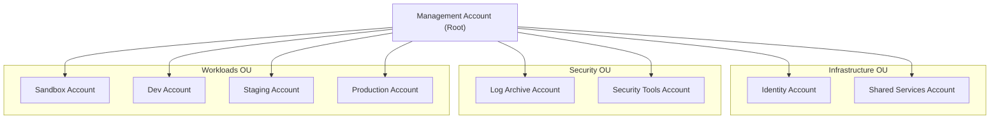

```mermaid
graph TD;
  %% === High-Level AWS Organization Structure ===
  ROOT["Management Account (Root)"];

  subgraph INFRA_OU ["Infrastructure OU"]
    IDACC["Identity Account"];
    SHARED["Shared Services Account"];
  end

  subgraph SEC_OU ["Security OU"]
    LOGARCH["Log Archive Account"];
    SECTOOLS["Security Tools Account"];
  end

  subgraph WRK_OU ["Workloads OU"]
    SBX["Sandbox Account"];
    DEV["Dev Account"];
    STG["Staging Account"];
    PRD["Production Account"];
  end

  %% Connect root to each account (simple, readable)
  ROOT --> IDACC;
  ROOT --> SHARED;
  ROOT --> LOGARCH;
  ROOT --> SECTOOLS;
  ROOT --> SBX;
  ROOT --> DEV;
  ROOT --> STG;
  ROOT --> PRD;
```