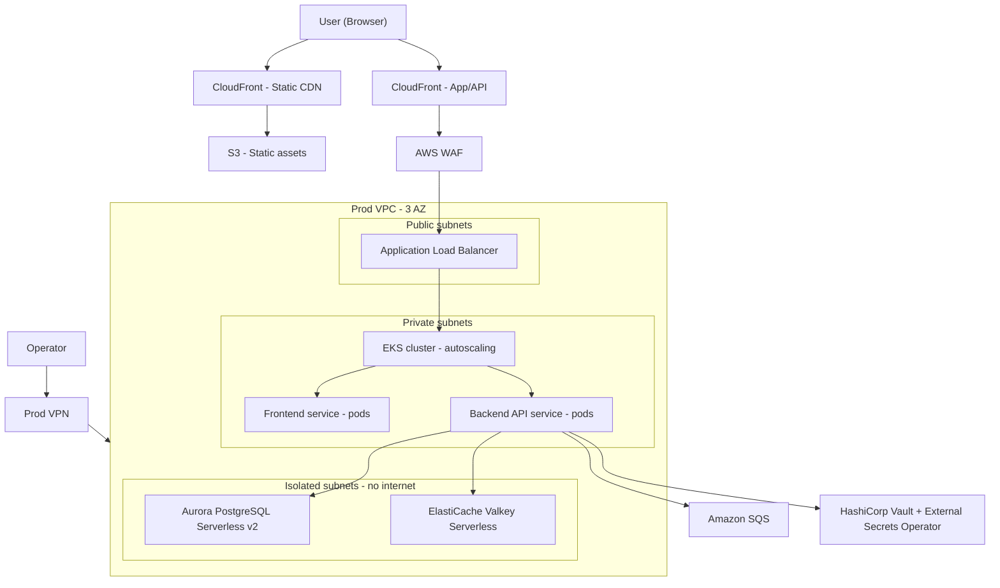

```mermaid
flowchart TD

%% === Production High-Level Infrastructure ===

%% Users and CDN paths
User["User (Browser)"] --> CFStatic["CloudFront - Static CDN"]
CFStatic --> S3Static["S3 - Static assets"]

User --> CFAPI["CloudFront - App/API"]
CFAPI --> WAF["AWS WAF"]
WAF --> ALB["Application Load Balancer"]

%% VPC layout
subgraph VPC["Prod VPC - 3 AZ"]
  direction TB

  subgraph Public["Public subnets"]
    ALB
  end

  subgraph Private["Private subnets"]
    EKS["EKS cluster - autoscaling"]
    Frontend["Frontend service - pods"]
    Backend["Backend API service - pods"]
  end

  subgraph Isolated["Isolated subnets - no internet"]
    Aurora["Aurora PostgreSQL Serverless v2"]
    Valkey["ElastiCache Valkey Serverless"]
  end
end

%% Ingress into cluster
ALB --> EKS
EKS --> Frontend
EKS --> Backend

%% App to data services (private, encrypted)
Backend --> Aurora
Backend --> Valkey

%% Async processing
SQS["Amazon SQS"]
Backend --> SQS

%% Secrets management for backend pods
Vault["HashiCorp Vault + External Secrets Operator"]
Backend --> Vault

%% Private access for operators
Operator["Operator"]
VPN["Prod VPN"]
Operator --> VPN
VPN --> VPC
```